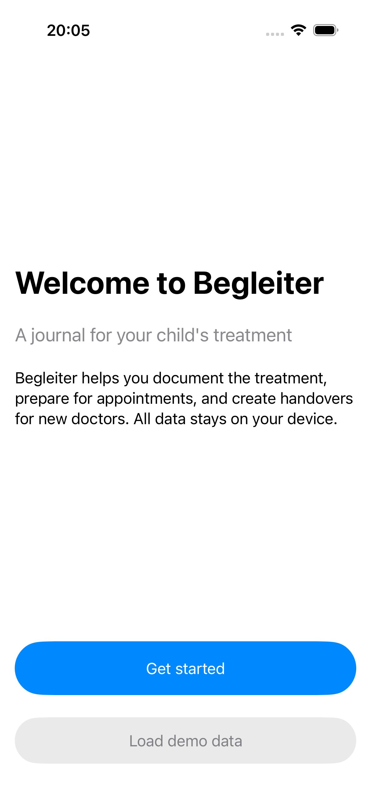
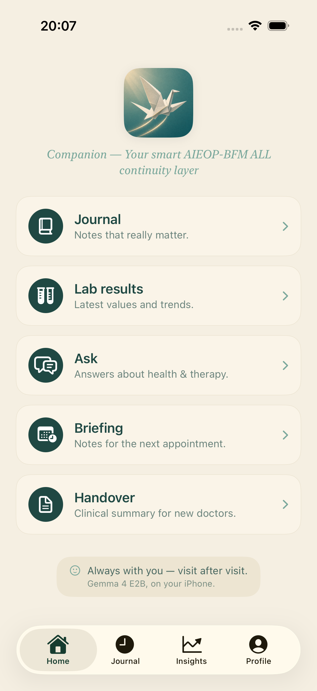
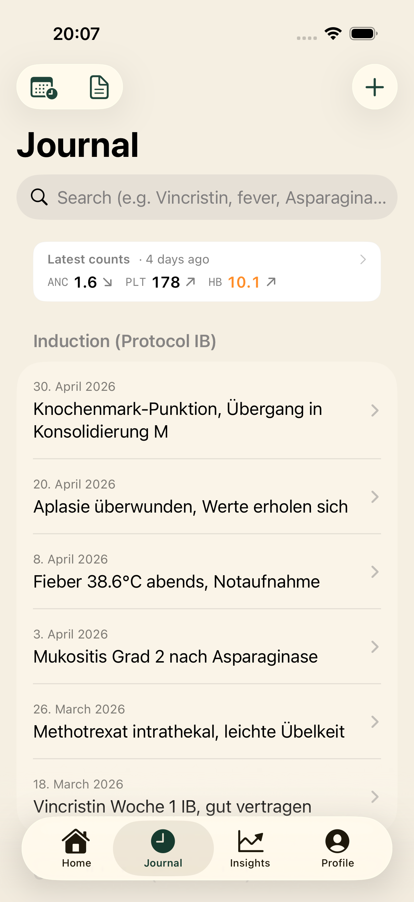
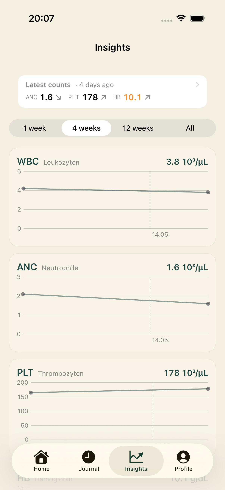
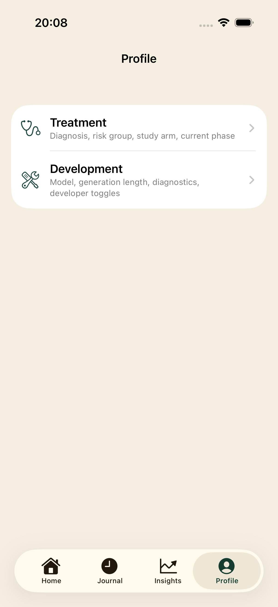
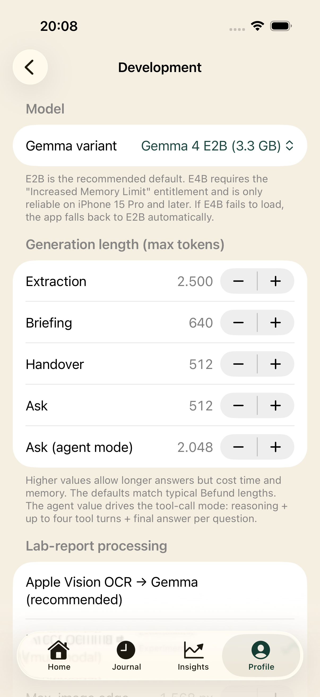

<div align="center">


# Begleiter

**A private on-device journal for parents during pediatric leukemia treatment.**

Native iOS, built on [Gemma 4](https://ai.google.dev/gemma) running locally through [mlx-swift-lm](https://github.com/ml-explore/mlx-swift-lm). No cloud, no telemetry, no server-side inference.

[](https://developer.apple.com/ios/)
[](https://www.swift.org/)
[](https://github.com/ml-explore/mlx-swift-lm)
[](LICENSE)
[](https://www.kaggle.com/competitions/gemma-4-good-hackathon)

</div>

> [!WARNING]
> **Hackathon demo, not a medical product.**
> Begleiter is a research prototype built as a Kaggle Gemma 4 Good
> Hackathon submission. It is not a medical device, has not been
> reviewed by any regulator, and is not intended for parents, patients,
> or clinicians. Do not use it to make any treatment decision. It does
> not diagnose, dose, interpret emergencies, or replace your care team.

> In a long leukemia protocol, doctors rotate. Parents are often the continuity layer. Begleiter helps them carry that story without sending it to a server.

---

## Screenshots

Captured on an iPhone 17 Pro Simulator after a fresh install + `Load demo data` from the welcome screen, which seeds a synthetic SR child on the BFM 2017 protocol with 10 journal entries and a chronological lab history.

<table>
  <tr>
    <td align="center" width="33%"><br/><sub><b>Onboarding</b> — fresh install, with a one-tap demo loader</sub></td>
    <td align="center" width="33%"><br/><sub><b>Home</b> — tile hub for Journal, Lab results, Ask, Briefing, Handover</sub></td>
    <td align="center" width="33%"><br/><sub><b>Journal</b> — entries grouped by treatment phase, latest counts pinned</sub></td>
  </tr>
  <tr>
    <td align="center" width="33%"><br/><sub><b>Insights</b> — WBC / ANC / PLT / HB trends with range picker</sub></td>
    <td align="center" width="33%"><br/><sub><b>Profile</b> — Behandlung (clinical) and Entwicklung (developer)</sub></td>
    <td align="center" width="33%"><br/><sub><b>Development</b> — Gemma variant, per-surface generation budgets, lab pipeline mode</sub></td>
  </tr>
</table>

---

## Why this exists

Pediatric ALL treatment runs ~2 years on the AIEOP-BFM protocol. Across that span, the rotating residents and oncologists who walk into a parent's hospital room rarely have time to read the chart end-to-end. Parents do. They remember which neutropenic episode caused which infection, which medication was paused on which day, what their child said about the side effects. The hospital's EHR captures most of it, but parents see the gaps — and they're the only continuous observer across every visit.

Begleiter is a structured place for parents to record those observations, keep their lab values close, prepare for the next appointment, and brief a new doctor — all on the phone in their pocket, with no upload to anywhere. The app is built for the [Kaggle Gemma 4 Good Hackathon](https://www.kaggle.com/competitions/gemma-4-good-hackathon), Health track.

Begleiter is **not** a clinical decision system. It does not diagnose, recommend medication changes, interpret emergency rules, or replace the care team.

---

## What it does

| Surface | What you do | What Gemma 4 does | Code path |
| --- | --- | --- | --- |
| **Capture** | Type or dictate a visit note; or photograph a lab printout | OCR or vision-tower passes feed Gemma, which extracts a structured JSON payload (medications, lab values, decisions, parent observations, open questions) | [`ExtractionService.swift`](Begleiter/Services/ExtractionService.swift) |
| **Timeline** | Browse and filter the chronological journal | — | [`Features/Timeline/`](Begleiter/Features/Timeline) |
| **Insights** | See WBC / ANC / PLT / HB trends over the whole protocol | — | [`Features/Insights/`](Begleiter/Features/Insights) |
| **Labs** | Ask in plain German for a chart of any value across any window | A small Gemma call parses the request into a strict `LabPlotSpec` JSON; the chart is rendered from local SwiftData | [`Features/Labs/`](Begleiter/Features/Labs), [`LabPlotParser`](Begleiter/Services/LabPlotParser.swift) |
| **Ask** | Ask a German question grounded in the journal + bundled clinical corpus | Either single-shot RAG, or a multi-turn function-calling agent that picks tools (`search_journal`, `search_corpus`, `get_lab_trend`, `get_phase_metadata`, `search_documents`) and stitches a cited answer | [`AskService.swift`](Begleiter/Services/AskService.swift), [`AgentTools.swift`](Begleiter/Services/AgentTools.swift) |
| **Briefing** | Tap "Vorbereitung" the night before a visit | Gemma reads the last 8 extracted entries and the current phase metadata, writes a five-section German pre-visit summary | [`BriefingService.swift`](Begleiter/Services/BriefingService.swift) |
| **Handoff** | Tap "Übergabe" when meeting a new doctor | Deterministic header + Gemma-written prose for `behandlungsverlauf` / `reaktionen` / `familienanliegen`, written for a rotating-doctor audience | [`HandoffService.swift`](Begleiter/Services/HandoffService.swift) |

Every AI surface ships behind a Settings toggle. Defaults are conservative — see [Feature toggles](#feature-toggles).

---

## Architecture at a glance

```text
                ┌─────────────────────┐
                │ SwiftUI Feature     │  (Home, Timeline, Ask, Labs, …)
                └──────────┬──────────┘
                           │
                ┌──────────▼──────────┐         ┌──────────────────────────┐
                │ Service actor       │────────▶│ GemmaService             │
                │  (Ask, Briefing,    │         │ GemmaVisionService       │
                │   Handoff, Extract) │         │  └─ mlx-swift-lm runtime │
                └──────────┬──────────┘         │     (LLMRegistry +       │
                           │                    │      VLMRegistry)        │
                ┌──────────▼──────────┐         └────────────┬─────────────┘
                │ SwiftData           │                      │
                │  ChildState         │                      │
                │  JournalEntry       │   ┌──────────────────▼─────────────┐
                │  ImportedDocument   │   │ HuggingFace on-device cache    │
                └──────────┬──────────┘   │  mlx-community/gemma-4-e2b-    │
                           │              │  it-4bit  (or e4b)             │
                ┌──────────▼──────────┐   └────────────────────────────────┘
                │ RetrievalService    │
                │  ├─ BM25 (Lucene-   │
                │  │  style tokenizer)│   ┌────────────────────────────────┐
                │  └─ E5-small dense  │◀──│ Bundled corpus.json            │
                │     reranker (opt.) │   │ (AIEOP-BFM-style references)   │
                └─────────────────────┘   └────────────────────────────────┘
```

The Ask **custom agent** loop is its own small state machine:

```text
build prompt ─▶ Gemma 4 ─▶ GemmaToolCallExtractor ─┬─▶ search_journal      ┐
       ▲                                           ├─▶ search_corpus       │
       │                                           ├─▶ get_lab_trend       │ context merge
       │                                           ├─▶ get_phase_metadata  │  + cite IDs
       │                                           └─▶ search_documents    │
       │                                                                   │
       └──────────── next turn (≤ N) ◀─────────────────────────────────────┘
                                  │
                                  ▼
                      JSON answer with [E:UUID] / [K:chunkId] / [D:UUID#idx]
                                  │
                                  ▼
                  filterAndWarn  ─▶ drop ungrounded citations,
                                    surface advice-shaped claims as warnings
```

---

## How Gemma 4 is used

### Model and runtime

- Default variant: **Gemma 4 E2B 4-bit** (`mlx-community/gemma-4-e2b-it-4bit`, ~3.3 GB on disk, ~2 GB resident). E4B (`mlx-community/gemma-4-e4b-it-4bit`, ~4.86 GB) is selectable in Settings; it requires `com.apple.developer.kernel.increased-memory-limit` (already declared in [`Begleiter.entitlements`](Begleiter/Begleiter.entitlements)) and only ships stable on iPhone 15 Pro or newer in practice.
- Loaded through `mlx-swift-lm`'s `LLMRegistry` for the text body and `VLMRegistry` for the multimodal sibling. [`GemmaService`](Begleiter/Services/GemmaService.swift) and [`GemmaVisionService`](Begleiter/Services/GemmaVisionService.swift) are mutually exclusive in memory — the text-only service unloads when the vision tower is brought up, and vice versa.
- `MLX.Memory.setCacheLimit(16 * 1024 * 1024)` caps MLX's recyclable buffer pool at 16 MB to keep jetsam at bay on 6 GB devices. The cap is applied *after* the first load so test runners on the Simulator never touch MLX symbols.
- If E4B fails to load on a device that can't host it, `GemmaService.reload(variant:)` demotes to E2B and persists the choice via `AppSettings.persistModelVariant(_:)` so the UI stays honest about what's running.

### Prompts per surface

| Surface | System prompt location | Output shape | maxTokens (default / range) | Temperature |
| --- | --- | --- | --- | --- |
| Extraction (omnibus) | [`ExtractionService.buildPrompt`](Begleiter/Services/ExtractionService.swift) | 10-field JSON | 2500 / 256–4096 | 0.3 |
| Lab-only extraction | [`ExtractionService.buildLabsOnlyPrompt`](Begleiter/Services/ExtractionService.swift) | CBC-only JSON list | 2500 / 256–4096 | 0.3 |
| Briefing | [`BriefingService.buildPrompt`](Begleiter/Services/BriefingService.swift) | 5-section German prose | 640 / 256–4096 | 0.5 |
| Handoff | [`HandoffService.buildPrompt`](Begleiter/Services/HandoffService.swift) | 3-section prose + citations | 512 / 256–4096 | 0.4 |
| Ask (single-shot) | [`AskService.buildPrompt`](Begleiter/Services/AskService.swift) | `{claims, followUps}` JSON | 512 / 256–8192 | 0.4 |
| Ask (custom agent) | [`AskService.buildCustomAgentSystemPrompt`](Begleiter/Services/AskService.swift) | per-turn tool call OR final JSON | 2048 / 1024–8192 | 0.4 |
| Lab plot parser | [`LabPlotParser`](Begleiter/Services/LabPlotParser.swift) | `LabPlotSpec` JSON | 512 | 0.2 |

All prompts are German-first and explicitly forbid clinical advice, diagnosis, dose calculation, or interpretation. The protocol metadata (phases, day windows, expected reactions) lives in plain Swift under [`Begleiter/Protocol/`](Begleiter/Protocol) so it's auditable — there is no "prompt magic" pretending to encode the protocol itself.

### Custom Gemma 4 tool-call parser

Gemma 4 emits tool calls in its own native format:

```text
call:search_journal{query:<|"|>Mukositis<|"|>, phase:<|"|>induction<|"|>}
```

`mlx-swift-lm` 3.31.3 doesn't recognise this format, so the `.mlxToolCall` Ask mode is kept only for the day it does. The shipping path is `.customAgent`: [`GemmaToolCallExtractor`](Begleiter/Services/GemmaToolCallExtractor.swift) tolerates:

- both `{...}` and `(...)` arg block delimiters
- both `<|"|>` and `<escape>"<escape>` string delimiters
- Python-flavored `None` / `True` / `False` literals (Gemma drifts into these when it has seen Python examples)
- missing commas between args
- a wrapping `<|tool_call>` envelope that doesn't affect semantics

Each of the five tools registered in [`AgentTools`](Begleiter/Services/AgentTools.swift) is a typed `Tool<Input, Output>` with auto-generated OpenAI-style JSON schema. Tool handlers decorate every result chunk with citation markers — `[E:UUID]` for journal entries, `[K:chunkId]` for corpus chunks, `[D:UUID#idx]` for imported PDFs — and Gemma threads them through into the final JSON answer.

### Verifiable generation

Hallucinated UUIDs are visually indistinguishable from real ones. So every cited claim is checked against the set of IDs that actually appeared in the prompt:

- [`AskService.filterAndWarn`](Begleiter/Services/AskService.swift) — drops claims whose `[E:...]` / `[K:...]` / `[D:...]` doesn't resolve, and surfaces advice-shaped claims as warnings rather than answers.
- [`BriefingService.filterUngroundedClaims`](Begleiter/Services/BriefingService.swift) and the handoff equivalent — the same rule for pre-visit summaries.
- `RefusalService.containsClinicalAdvice(...)` pattern-matches German clinical-advice phrases (diacritic-folded, case-insensitive). Matches get scrubbed to a canonical redirect: *"Diese Frage gehört zu Ihrem Behandlungsteam. Das Tagebuch kann Ihnen helfen, sich darauf vorzubereiten — möchten Sie diese als offene Frage für Ihren nächsten Besuch hinzufügen?"*

`EventQuestionDetector` short-circuits past-tense questions ("Wann hatte er Fieber?") with a deterministic *"Im Journal finde ich dazu keinen Eintrag."* when journal retrieval is empty — so the app doesn't paraphrase corpus chunks into something that reads like a journal claim.

### Streaming and the latency HUD

- `ChatSession.streamResponse(to:)` yields token chunks; [`GemmaService`](Begleiter/Services/GemmaService.swift) accumulates them and emits them as an `AsyncStream<String>` to the UI.
- `OSSignposter` wraps a `"generate"` interval with a nested `"generate.prefill"` so prefill → time-to-first-token (TTFT) and decode → elapsed are measured separately.
- Logs report `promptChars` (PII-free) and `outputTokensApprox` (4 chars / token). Each measurement is pushed to [`GemmaLatencyHUD`](Begleiter/Features/Debug/LatencyHUDView.swift), an opt-in floating chip showing `elapsedMs`, `ttftMs`, and `decodeTokPerSec`.

### Thinking mode

`GemmaService.generate(enableThinking:)` injects `additionalContext: ["enable_thinking": true]` into the chat template. Gemma 4 emits a `<|channel>thought` reasoning block before its answer, costing a few hundred extra output tokens — paired with `askAgentMaxTokens ≥ 1024`. The custom Ask agent runs with thinking on; single-shot chat runs without.

---

## Feature toggles

Every Gemma surface ships behind a toggle. Defaults pick the safest path that still demonstrates the model. Source of truth: [`AppSettings.swift`](Begleiter/Common/AppSettings.swift).

| Flag | Default | Effect |
| --- | --- | --- |
| `modelVariant` | `.e2b` | E2B (3.3 GB) or E4B (4.86 GB). E4B persists demotion on load failure. |
| `labPipelineMode` | `.ocrThenGemma` | Apple Vision OCR → text Gemma, or directly to `GemmaVisionService`. |
| `visionMaxLongEdge` | 1568 px | Long-edge resize for vision-tower inputs (range 768–2048). |
| `labExtractionShortcutEnabled` | `true` | Shows "Blutbild aus Befund" focused CBC capture. |
| `askMode` | `.chat` | Single-shot RAG, broken upstream `mlxToolCall`, or shipping `customAgent`. |
| `askMaxTokens` | 512 | Single-shot Q&A budget (256–8192). |
| `askAgentMaxTokens` | 2048 | Per-turn budget for the agent loop (1024–8192). |
| `askThinkingEnabled` | `false` | Inject `<|think|>` into every Ask call. |
| `askDiagnosticsEnabled` | `false` | Show retrieval / parse / filter debug UI per Q&A. |
| `askDenseRerankerEnabled` | `false` | Loads multilingual-E5-small for RRF rerank. |
| `askEventGuardEnabled` | `true` | Short-circuit past-tense questions on empty journal. |
| `askTimelinePackEnabled` | `true` | Send the chronological journal (token-budgeted) vs top-4 BM25 hits. |
| `importedDocsEnabled` | `true` | Surfaces Dokument-Speicher and the 5th `search_documents` tool. |
| `docImportMaxChars` | 12 000 | Per-PDF character cap (4 000–64 000). |
| `extractionMaxTokens` | 2500 | Budget for OCR → JSON extraction (256–4096). |
| `briefingMaxTokens` | 640 | Budget for pre-visit summaries (256–4096). |
| `handoffMaxTokens` | 512 | Budget for the doctor handoff (256–4096). |
| `latencyHUDEnabled` | `false` | Floating chip showing TTFT and decode tok/s. |

A fresh install also runs `AppSettings.applyDemoDefaultsIfNeeded(...)` once, which flips `labPipelineMode → .directMultimodal` and `askMode → .customAgent` so the first launch shows the flagship Gemma 4 surfaces without a Settings dig. The migration is one-shot and never re-overrides a user who later switches back.

---

## What we learned

Notes from actually running Gemma 4 on a phone, in German, for a medical use case:

1. **Omnibus prompts collapse lab recall on small VLMs.** A 10-field JSON extractor on E2B silently drops dual-value rows (`NEUT 0.38 [10^3/uL] 20.9 [%]`) when the rest of the schema competes for attention. Splitting out a focused CBC-only prompt ([`extractLabValuesOnly`](Begleiter/Services/ExtractionService.swift) + the "Blutbild aus Befund" button) restored parameter recall to 0.65–0.82 with parse rate 0.97. Lab-only entries skip the omnibus path entirely.

2. **Example lists in prompts prime copying, not grounding.** An earlier "Was mitnehmen" briefing section showed Gemma a sample bullet list ("Heparin-Block, Wäsche, Pass"). The model started copying those items verbatim across runs instead of grounding them in journal entries — and because no `entryId` was attached, the verifiable-generation guard couldn't catch it. The section was removed; the remaining prompts explicitly require an `entryId` on every bullet and tell the model to *omit* the item if it can't tie one.

3. **Verifiable generation beats disclaimers.** Hallucinated UUIDs are visually indistinguishable from real ones. We post-parse-filter every claim against the prompted ID set rather than trying to prompt the hallucination away.

4. **E2B vs E4B is a memory-budget decision, not a quality decision.** E2B (3.3 GB) fits on every Increased-Memory-Limit-capable iPhone 14 Pro. E4B (4.86 GB) is only stable on iPhone 15 Pro+ in practice. We ship E2B as default with a `reload(variant:)` path that auto-demotes and persists the choice.

5. **The upstream Gemma 4 tool-call layer wasn't ready.** Rather than force Gemma into a JSON shape it doesn't natively emit, we wrote a tolerant parser ([`GemmaToolCallExtractor`](Begleiter/Services/GemmaToolCallExtractor.swift)) for the format the model *actually* produces and kept the upstream path behind a separate flag for when it lands.

6. **Temperature matters by surface, not globally.** Extraction wants 0.3 (deterministic JSON); plot parsing wants 0.2 (strict numeric output); briefing wants 0.5 (German prose without drift); handoff and Ask sit at 0.4. One global temperature would have been wrong for every surface.

7. **Direct multimodal vs OCR-then-text is a 200–300 MB tradeoff.** The vision tower handles handwritten margin notes and multi-column lab tables better, but costs an extra 200–300 MB resident on top of the LM body and triggers an unload/reload of the text sibling. We ship both, default to OCR, and let users opt in to multimodal in Settings.

8. **Format discipline by example.** The agent system prompt shows both a *correct* `call:search_journal{query:<|"|>term<|"|>}` example **and** a *wrong* Python-flavored `call:search(query="term", phase=None)` example. Including the negative example dropped format drift to near zero in our manual sweeps.

---

## Privacy

- No telemetry, analytics, cloud sync, or server-side inference.
- The clinical corpus is bundled in [`Begleiter/Resources/corpus.json`](Begleiter/Resources/corpus.json) with per-document source headers.
- The only network dependency is the first-launch model download from Hugging Face. After the model is cached, the app works in airplane mode.
- All journal data lives in a local SwiftData store and never leaves the device.

---

## Quickstart

**Requirements**

- macOS with Xcode 26+
- A physical iPhone with Increased Memory Limit support — iPhone 14 Pro or newer
- Free Apple Developer account for device signing

**Build and run**

```sh
git clone https://github.com/simonsays095/kaggle_gemma4-new-ai-features
cd kaggle_gemma4-new-ai-features
open Begleiter.xcodeproj
```

1. Plug in the iPhone and select it as the run destination.
2. In *Signing & Capabilities*, confirm **Increased Memory Limit** is present (declared via [`Begleiter.entitlements`](Begleiter/Begleiter.entitlements)).
3. Run the app. First launch downloads `mlx-community/gemma-4-e2b-it-4bit` into the on-device Hugging Face cache (~3.3 GB, one-time).
4. Open *Settings → Diagnose*. The memory ceiling should report the increased per-app limit, not the default low one.
5. Tap *Settings → Entwicklung → Demo-Daten laden* to populate a synthetic child, chronological journal, and lab values. The loader refuses to overwrite real data.

**Simulator caveat.** MLX-Swift cannot initialize its Metal backend on the iOS Simulator (SIGABRT in `mlx::core::metal::Device::Device`). The non-MLX code paths build and run fine — UI screens, demo data, settings — but every Gemma generation requires a physical device. The MLX import in `BegleiterApp.swift` is intentionally lazy so tests and Simulator runs never touch the symbol.

---

## Tests

```sh
xcodebuild test \
  -project Begleiter.xcodeproj \
  -scheme Begleiter \
  -destination 'platform=iOS Simulator,name=iPhone 17 Pro'
```

Tests cover the protocol state machine, retrieval, tool dispatch, the custom Gemma 4 tool-call parser, extraction JSON parsing, lab plot resolution, citation filtering, refusal patterns, and the timeline-pack token budget. MLX-driven generation itself is not exercised by the test bundle — that path requires a physical iPhone.

---

## Repository layout

```text
Begleiter/
├── App/                  @main entry, RootView, memory-warning observer
├── Common/               Runtime settings + feature toggles (AppSettings)
├── Protocol/             Deterministic AIEOP-BFM-style phase metadata
├── Models/               SwiftData models (ChildState, JournalEntry, ImportedDocument)
├── Features/
│   ├── Home/             Tile-based hub
│   ├── Timeline/         Chronological journal
│   ├── Insights/         Lab trend charts + status pill
│   ├── Capture/          Text/voice/photo capture flows
│   ├── Ask/              Single-shot RAG + custom-agent UI
│   ├── Labs/             Lab plot composer + parameter detail
│   ├── Briefing/         Pre-visit summaries
│   ├── Handoff/          Rotating-doctor catch-up
│   ├── Settings/         Feature toggles, diagnostics, demo data loader
│   ├── Onboarding/       Child setup
│   ├── Debug/            Latency HUD + on-device smoke test
│   ├── Voice/            Voice capture
│   └── Photo/            Photo capture
├── Services/             Gemma, vision, extraction, retrieval, tools, reports
└── Resources/            Localization (de/en) + bundled clinical corpus

BegleiterTests/           XCTest coverage for non-MLX logic
BegleiterUITests/         UI smoke tests
docs/
├── hero.png              README hero image
└── screenshots/          Simulator and device captures
```

---

## Acknowledgments

- The [MLX team](https://github.com/ml-explore) and the [mlx-swift-lm](https://github.com/ml-explore/mlx-swift-lm) maintainers for making Gemma 4 actually run on a phone.
- The [Gemma](https://ai.google.dev/gemma) team at Google DeepMind.
- The [Kaggle Gemma 4 Good Hackathon](https://www.kaggle.com/competitions/gemma-4-good-hackathon) for the brief.
- The clinical corpus retains its source licenses; per-document headers are preserved inside `Begleiter/Resources/corpus.json`.

---

## License

Source code: [MIT](LICENSE). The bundled clinical corpus retains its individual document licenses.
